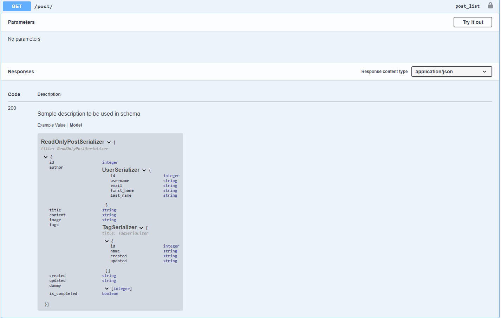
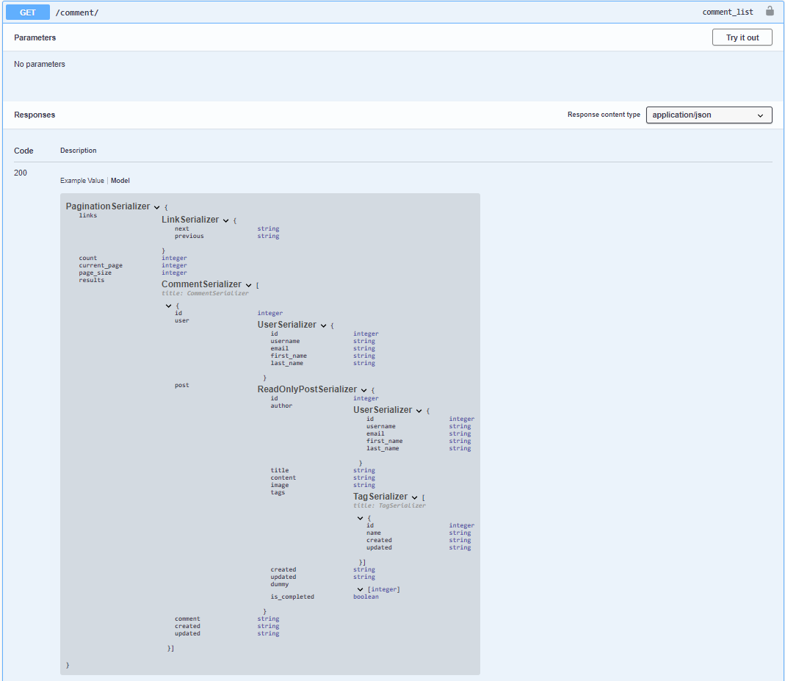

# Swagger Generation Example 
*************

Example is available in test_django_app, you can run the app after
cloning the project.

```python
python test_django_app/manage.py runserver
```

## Swagger Generation

Note that the swagger generation is for `drf_serpy.Serializer` and doesn't care about the inputted model.
i.e. the `openapi.Schema` will be generated based on the serializer attributes.

```python
import drf_serpy as serpy
from drf_yasg.utils import swagger_auto_schema
from rest_framework import status
from rest_framework.response import Response
from rest_framework.viewsets import ModelViewSet

from .models import Post 
from .serializers import drf, serps

# serps.ReadOnlyPostSerializer is this:
# class ReadOnlyPostSerializer(serpy.Serializer):
#     """
#     Sample description to be used in schema
#     """
#     id = serpy.IntField()
#     author = UserSerializer()
#     title = serpy.StrField()
#     content = serpy.StrField()
#     image = serpy.ImageField()
#     tags = TagSerializer(many=True)
#     created = serpy.DateTimeField()
#     updated = serpy.DateTimeField()
#     dummy = serpy.MethodField()
#     is_completed = serpy.MethodField()

#     def get_dummy(self, value) -> List[int]:
#         return list(range(1, 10))

#     # typing is necessary to create schema, otherwise this will throw an assertion error
#     def get_is_completed(self, value) -> bool:
#         return True

class PostViewSet(ModelViewSet):
    queryset = Post.objects.all()
    serializer_class = drf.PostSerializer

    @swagger_auto_schema(
        responses={
            200: ReadOnlyPostSerializer.to_schema(many=True),
        },
    )
    def list(self, request, *args, **kwargs):
        # get your objects
        serializer = serps.ReadOnlyPostSerializer(instance=self.queryset.all(), many=True)
        return Response(data=serializer.data, status=status.HTTP_200_OK)
```

Generated Swagger:


## Generic serializer swagger generation

```python

# class CommentSerializer(drf_serpy.Serializer):
#     id = drf_serpy.IntField()
#     user = UserSerializer()
#     post = ReadOnlyPostSerializer()
#     comment = drf_serpy.StrField()
#     created = drf_serpy.DateTimeField()
#     updated = drf_serpy.DateTimeField()


# class LinkSerializer(drf_serpy.Serializer):
#     next = drf_serpy.StrField()
#     previous = drf_serpy.StrField()


# class PaginationSerializer(drf_serpy.Serializer):
#     links = LinkSerializer()
#     count = drf_serpy.IntField()
#     current_page = drf_serpy.IntField()
#     page_size = drf_serpy.IntField()
#     results = drf_serpy.Serializer()

class CommentViewSet(ModelViewSet):
    queryset = Comment.objects.all()
    serializer_class = drf.CommentSerializer

    @swagger_auto_schema(
        responses={
            200: PaginationSerializer.to_schema(serializer=CommentSerializer(many=True)),
        },
    )
    def list(self, request, *args, **kwargs):
        self.serializer_class = serps.CommentSerializer
        return super().list(request, *args, **kwargs)
```
    
Generated Swagger:

